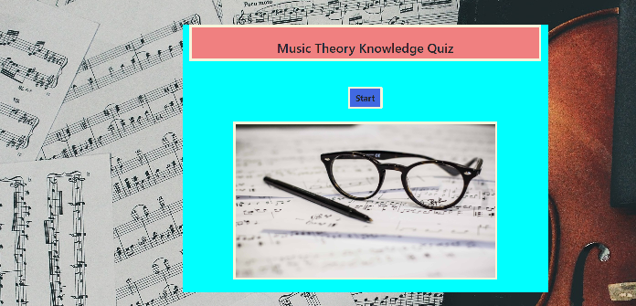
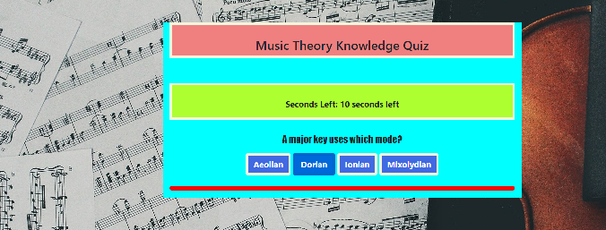
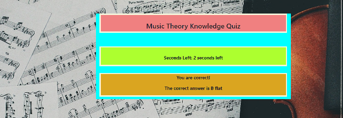
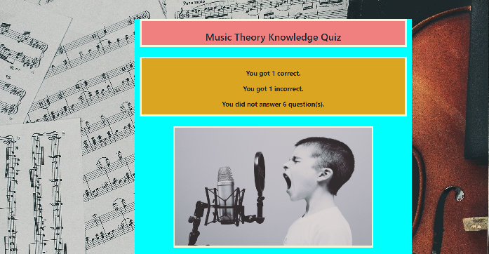

## Trivia-Game-Advanced

### This Trivia game is in the form of a music theory quiz. It is designed to illustrate the use of timers. The player is first presented with a start screen.

### The player is then taken to a question screen. The player has ten seconds to answer the question.

### If the question is not answered, the next question screen is presented. If the question is answered, a new timer is set for four seconds and the player is told whether the answer is correct or not. In either case, the correct answer is shown.

### After all the question screens are completed, the player is shown the number of correct, incorrect, and unanswered questions.

### The technologies used are HTML, CSS, and JQuery. The game was designed and implemented by a sole contributor which is myself.